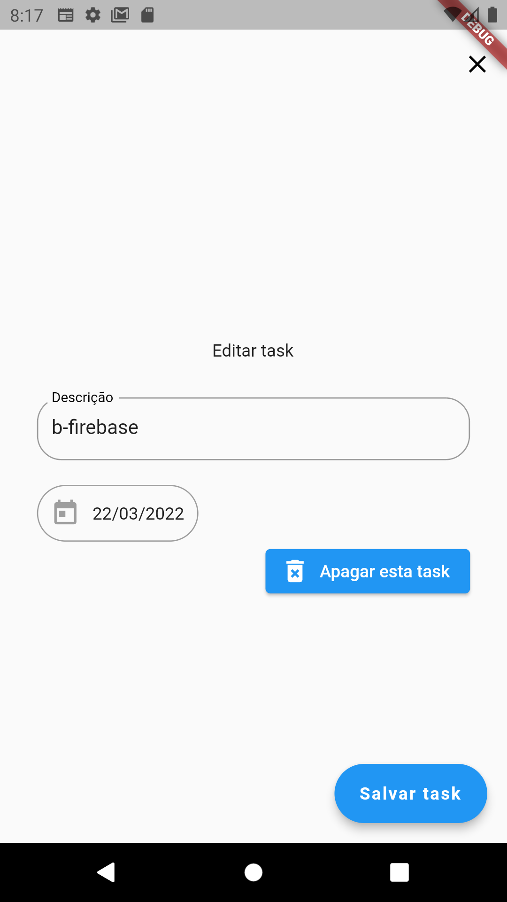
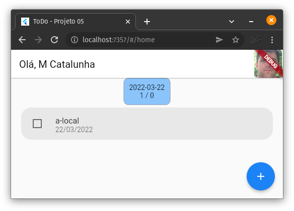
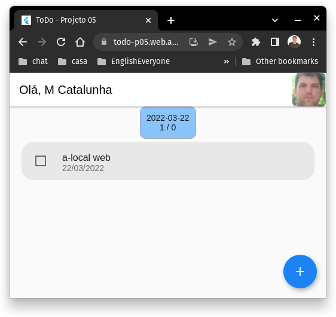

# Agradecimento
Este projeto só foi possivel devido a cooperação direta do Marcus Brasizza e do Rodrigo Rahman e da galera da Academia do Flutter http://academiadoflutter.com.br/

# Telas
App disponivel em: https://todo-p05.web.app

|||
|---|---|
|||
|||
|||
|||


# ChangeLog
## [1.0.0]


# Branchs
## [Master/main]
Com cleanCode e HiveMap.
## [cleanCode]
Construção em cleanCode e foi para master
## [HiveMap]
Apenas armazenando o Hive no formato mapa para testar o HiveAdpater. 
## [HiveAdapter]
Nao achei interessante o hive adapter pelo foco do app ser buscar por datas e achei mais interessante o armazenamento puro em map.
## [mvvm]
versao inicial com mvvm

# Estrutura
Leituras para analise e adaptação deste projeto a, View - ViewModel - Model e CleanCode:
* http://kyubid.com/blog/mvvm-android-tutorial-01-mvc-vs-mvp-vs-mvvm/
* https://pub.dev/packages/flutter_clean_architecture
* https://medium.com/@ajliberatore/android-clean-architecture-mvvm-4df18933fa9
* https://medium.com/@fahrizalfms/sample-android-project-mvvm-clean-architecture-with-coroutines-tips-a4d1b43b3583
* https://medium.com/@mashoodsidd97/understanding-of-clean-architecture-in-your-flutter-apps-with-tdd-test-driven-development-e674429fa0d
* https://medium.com/@mashoodsidd97/clean-architecture-tdd-with-flutter-part-2-968c7fc52c5b
* 

# Authentication
O Fluxo de autenticação segue esta abordagem:
1. Usuário acessa ao aplicativo e **splash.page** analisa sua situação. Se estiver logado vai para **home.page**.
2. Usuário acessa ao aplicativo e **splash.page** analisa sua situação. Se não estiver logado vai para **login.page**.
3. Usuário informa email/senha e se cadastrado e informações adicionais regularizadas e vai para **home.page**.
4. Usuário informa provedor de acesso e se cadastrado e informações adicionais regularizadas vai para **home.page**.
5. Se solicitar cadastrar email/senha para acesso vai para **methodEmailSenha.page**.
6. Após informar email/senha para cadastro se existir informações adicionais segue para **UserAdditionalInfo.page**.
7. Usuário informa email/senha e se cadastrado e informações adicionais irregulares vai para **UserAdditionalInfo.page**.
8. Usuário informa provedor de acesso e se cadastrado e informações adicionais irregulares vai para **UserAdditionalInfo.page**.
9. Registrada as informações adicionais se não houver analise vai para **home.page**.
10. Registrada as informações adicionais se houver analise vai para **UserAnalyzingInfo.page**. E espera-se liberação dos administradores do app. 


## MVVM/CleanCode
Se o objetivo de uma abstração/interface é guiar as implementações ?
Esta abordagem a seguir esta correta ?
* view
* view-model
* model
  * models
    * taskModel.dart
  * repositories
    * task_repository_abstract.dart
    * firebase
      * task
        * task_repository_impl.dart
    * hive
      * task
        * task_repository_impl.dart

model/repositories/task_repository_abstract.dart
```Dart
abstract class TaskRepositoryAbstract {
  Future<void> create(TaskModel taskModel);
}
```
## Firebase
model/repositories/firebase/task_repository_impl.dart
```Dart
class TaskRepositoryImpl implements TaskRepositoryAbstract {
  @override
  Future<void> create(TaskModel taskModel){
    // create modo Firebase
  }
}
```
## Hive
model/repositories/hive/task_repository_impl.dart
```Dart
class TaskRepositoryImpl implements TaskRepositoryAbstract {
  @override
  Future<void> create(TaskModel taskModel){
    // create modo Hive
  }
}
```


## ToDo-Versão 5 com 2 Databases

### Problema dos databases
1) Estrutura completa do projeto
```Dart
lib/app
├── data
│   ├── datasources
│   │   ├── firebase
│   │   └── hive
│   └── repositories
├── domain
│   ├── models
│   └── usecases
└── presentation
    ├── controllers
    ├── pages
    └── routes.dart
```

2) Repositorio e suas implementações com base em cada banco.
```
data
├── datasources
│   ├── firebase
│   │   ├── task
│   │   │   ├── task_repository_exception.dart
│   │   │   └── task_repository_firebase_impl.dart
│   ├── hive
│   │   ├── task
│   │   │   ├── task_repository_exception.dart
│   │   │   └── task_repository_hive_impl.dart
└── repositories
    ├── task_repository.dart
```
3) O uuid é necessario para separar usuarios. As demais funcões são padrao.
```Dart
abstract class TaskRepository {
  void setUserUuid(String uuid);
  Future<void> create(TaskModel taskModel);
  ...
}
```
4) No modelo MVVM seria o taskService. Que em cleanCode coloquei em domain. 
Mas apenas chama o repo a partir do controle
```
domain
├── models
│   ├── task
│   │   ├── task_model.dart
└── usecases
    ├── task
    │   ├── task_usecase.dart
    │   ├── task_usecase_exception.dart
    │   └── task_usecase_impl.dart
```
5) O exemplo do taskService ou taskUseCase
```Dart
class TaskUseCaseImp implements TaskUseCase {
  @override
  Future<void> create(TaskModel taskModel) {
    _taskRepository.setUserUuid(_userService.userModel.uuid);
    return _taskRepository.create(taskModel);
  }
...
}
```

6) O controller e o binding.
```
presentation/controllers/task
└── append
    ├── task_append_controller.dart
    └── task_append_bindings.dart
```
---> 7) Agora vem a escolha de qual implementaçaõ usar ?
```Dart
class TaskAppendBindings implements Bindings {
  @override
  void dependencies() {
    var userService = Get.find<UserService>();
    print('+++ Qual database do usuario: ${userService.userModel.database}');
    if (userService.userModel.database == 'firebase') {
      Get.put<TaskRepository>(
        TaskRepositoryFirebaseImp(firebaseFirestore: Get.find()),
      );
    } else {
      Get.put<TaskRepository>(
        TaskRepositoryHiveImp(),
      );
    }
    Get.put<TaskUseCase>(
      TaskUseCaseImp(taskRepository: Get.find(), userService: Get.find()),
    );
    Get.lazyPut<TaskAppendController>(
        () => TaskAppendController(taskUseCase: Get.find()));
  }
}
```

### Resposta do marcus
```Dart
static NetWorkPrint? instance;

 NetWorkPrint.();
  static NetWorkPrint get instance {
    instance ??= NetWorkPrisnt.();
    return _instance!;
  }
```

```Dart
class GeneralPrinterContorller extends GetxController {
PhysicalPrinter get physical => PhysicalPrinter.instance;
NetWorkPrint get network => NetWorkPrint.instance;
SunmiPrinterDevice get sunmi => SunmiPrinterDevice.instance;
ElginPrinterDevice get elgin => ElginPrinterDevice.instance;
  var _printerInstance;
  T printerInstance<T>() {
    return _printerInstance as T;
  }
  T? printer<T>(Map<String, dynamic>? printer) {
    if (printer?['impressora'] == null) {
      _printerInstance = null; // null; physical as T;
      return null;
    } else {
      if (printer?['impressora']['fabricante'] == 'M8_M10') {
        _printerInstance = elgin as T;
        return elgin as T;
      }
      if (printer?['impressora']['fabricante'] == 'SUNMI_50' || printer?['impressora']['fabricante'] == 'SUNMI_80') {
        if (printer?['impressora']['fabricante'] == 'SUNMI_50') {
          sunmi.paper = PaperSize.mm58;
        }
        _printerInstance = sunmi as T;
        return sunmi as T;
      }
      if (printer?['impressora']['local_device'] != null && printer?['impressora']['local_device'] != '') {
        physical.devicePort = printer?['impressora']['local_device'];
        _printerInstance = physical as T;
        return physical as T;
      } else {
        if (printer?['impressora']['impressora_rede'] != null && printer?['impressora']['impressora_rede'] != '') {
          if (printer?['impressora']['porta_rede'] == "" || printer?['impressora']['porta_rede'] == null) {
            network.port = 9100;
          } else {
            try {
              network.port = int.parse(printer?['impressora']['porta_rede']);
            } catch (_) {
              network.port = 9100;
            }
          }
          network.ip = printer?['impressora']['impressora_rede'];
          _printerInstance = network as T;
          return network as T;
        } else {
          _printerInstance = physical as T;
          return physical as T;
        }
      }
    }
  }
}

```
É uma instancia burra.
Depois vc especifica qual instancia correta com base no map.
```Dart
      Get.put<GeneralPrinterContorller>(
        GeneralPrinterContorller(),
      );
GeneralPrinterContorller _serial = Get.find<GeneralPrinterContorller>().printer(_empresaController.empresaHive.equipamentoHost);
      var _impressora = _serial.printerInstance();

```


```Dart

Future<bool> imprimirTef(String payloadTef) async {
    try {
      var _impressora = _serial.printerInstance();
      if (_impressora == null) {
        return false;
      }

      final profile = await CapabilityProfile.load();
      final generator = Generator(_impressora.paper ?? PaperSize.mm80, profile);
      List<int> _bytes = [];

      String _decoded = Utils.base64ToString(payloadTef.replaceAll('\n', ''));
      _bytes += generator.text(_decoded, styles: PosStyles(fontType: PosFontType.fontA, height: PosTextSize.size1, width: PosTextSize.size1));
      _bytes += generator.reset();
      await _impressora.printByte(_bytes);
      await _impressora.feed(3);
      await impressora.cut();
      return true;
    } catch () {
      return false;
    }
  }

```


### Modo de resolver 01 - if (meu) [:-(((]
If nas dependencias.
```Dart
class TaskAppendBindings implements Bindings {
  @override
  void dependencies() {
    var userService = Get.find<UserService>();
    print('+++ Qual database do usuario: ${userService.userModel.database}');
    if (userService.userModel.database == 'firebase') {
      Get.put<TaskRepository>(
        TaskRepositoryFirebaseImp(firebaseFirestore: Get.find()),
      );
    } else {
      Get.put<TaskRepository>(
        TaskRepositoryHiveImp(),
      );
    }
    Get.put<TaskUseCase>(
      TaskUseCaseImp(taskRepository: Get.find(), userService: Get.find()),
    );
    Get.lazyPut<TaskAppendController>(
        () => TaskAppendController(taskUseCase: Get.find()));
  }
}
```
### Modo de resolver 02 - tag [:-;]
Usando tags nas dependencias.

```Dart
class HomeDependencies implements Bindings {
  @override
  void dependencies() {
    var userService = Get.find<UserService>();
    print('+++ HomeDependencies: ${userService.userModel.database}');
    Get.put<TaskRepository>(
      TaskRepositoryFirebaseImp(firebaseFirestore: Get.find()),
      tag: 'Firebase',
    );
    Get.put<TaskRepository>(
      TaskRepositoryHiveImp(),
      tag: 'Hive',
    );
    Get.put<TaskUseCase>(
      TaskUseCaseImp(
          taskRepository: Get.find(tag: (userService.userModel.database)),
          userService: Get.find()),
    );
    Get.lazyPut<HomeController>(
      () => HomeController(
        taskService: Get.find(),
        userService: Get.find(),
      ),
    );
  }
}
```
### Modo de resolver 03 - (Brasizza) [:-))))]
Usando modo brasizza.
Simplesmente um modo lindo - CleanCode.

```Dart
class DataBasesService extends GetxService {
  TaskRepositoryHiveImp get hive => TaskRepositoryHiveImp.instance;
  TaskRepositoryFirebaseImp get firebase => TaskRepositoryFirebaseImp.instance;

  var _dataBaseInstance;
  T dataBaseInstance<T>() {
    return _dataBaseInstance as T;
  }

  T dataBaseConfig<T>(Map<String, dynamic> database) {
    if (database['dataBaseType'] == 'Firebase') {
      firebase.userUuid = database['userUuid'];
      firebase.firebaseFirestore = Get.find();

      _dataBaseInstance = firebase as T;
      return firebase as T;
    } else {
      hive.userUuid = database['userUuid'];

      _dataBaseInstance = hive as T;
      return hive as T;
    }
  }
}
```

```Dart
class HomeDependencies implements Bindings {
  @override
  void dependencies() {
    Get.put<DataBasesService>(
      DataBasesService(),
    );
    Get.put<TaskUseCase>(
      TaskUseCaseImp(dataBasesService: Get.find(), userService: Get.find()),
    );
    Get.lazyPut<HomeController>(
      () => HomeController(
        taskService: Get.find(),
        userService: Get.find(),
      ),
    );
  }
}
```

```Dart
class TaskUseCaseImp implements TaskUseCase {
  DataBasesService _dataBasesService;
  UserService _userService;

  TaskUseCaseImp({
    required DataBasesService dataBasesService,
    required UserService userService,
  })  : _dataBasesService = dataBasesService,
        _userService = userService {
    dataBaseConfig();
  }
  var _database;
  void dataBaseConfig() {
    var userService = Get.find<UserService>();
    var map = {
      'dataBaseType': userService.userModel.database,
      'userUuid': userService.userModel.uuid,
    };
    _dataBasesService.dataBaseConfig(map);
    _database = _dataBasesService.dataBaseInstance();
  }

  @override
  Future<void> create(TaskModel taskModel) {
    return _database.create(taskModel);
  }
}
```

## Modo de resolver 03 - (RodrigoRahman) [:-)))))))))))]
Analisar e aplicar este padrão:
https://refactoring.guru/pt-br/design-patterns/abstract-factory

```Dart
enum DatasourcesEnum {
  hive,
  firebase,
  isar,
  couchbase,
  appwrite,
}
```
Mas vamos começar do começo. A estrutura das pastas
```
data
├── datasources
│   ├── datasources.dart
│   ├── firebase
│   │   ├── task
│   │   │   ├── task_repository_exception.dart
│   │   │   ├── task_repository_factory_firebase.dart
│   │   │   └── task_repository_firebase_impl.dart
│   ├── hive
│   │   ├── task
│   │   │   ├── task_repository_exception.dart
│   │   │   ├── task_repository_factory_hive.dart
│   │   │   └── task_repository_hive_impl.dart
└── repositories
    ├── factories
    │   └── task_repository_factory.dart
    ├── task_repository.dart
...
domain
├── models
│   ├── task
│   │   ├── task_model.dart
├── services
│   └── user_service.dart
└── usecases
    ├── task
    │   ├── task_usecase.dart
    │   ├── task_usecase_exception.dart
    │   └── task_usecase_impl.dart
...
presentation
├── controllers
│   ├── task
│   │   └── append
│   │       ├── task_append_controller.dart
│   │       └── task_append_dependencies.dart
├── pages
│   ├── task
│   │   └── append
│   │       ├── part
│   │       └── task_append_page.dart
└── routes.dart
```
A interface do repositorio
```Dart
abstract class TaskRepository {
  Future<void> create(TaskModel taskModel);
}
```
E sua implementação para Hive
```Dart
class TaskRepositoryHiveImp implements TaskRepository {
  static TaskRepositoryHiveImp? _instance;

  TaskRepositoryHiveImp._();
  static TaskRepositoryHiveImp get instance {
    _instance ??= TaskRepositoryHiveImp._();
    return _instance!;
  }

  String _userUuid = '';
  set userUuid(String uuid) {
    _userUuid = uuid;
  }

  @override
  Future<void> create(TaskModel taskModel) async {
    var box = await Hive.openBox(_userUuid);
    await box.put(taskModel.uuid, taskModel.toJson());
    await box.close();
  }
}
```
E sua implementação para Firebase
```Dart
class TaskRepositoryFirebaseImp implements TaskRepository {
  static TaskRepositoryFirebaseImp? _instance;

  TaskRepositoryFirebaseImp._();
  static TaskRepositoryFirebaseImp get instance {
    _instance ??= TaskRepositoryFirebaseImp._();
    return _instance!;
  }

  String _userUuid = '';
  set userUuid(String uuid) {
    _userUuid = uuid;
  }

  FirebaseFirestore? _firebaseFirestore;
  set firebaseFirestore(FirebaseFirestore firebaseFirestore) {
    _firebaseFirestore = firebaseFirestore;
  }

  @override
  Future<void> create(TaskModel taskModel) async {
    print('create firebase');
    try {
      CollectionReference docRef = _firebaseFirestore!
          .collection(UserModel.collection)
          .doc(_userUuid)
          .collection(TaskModel.collection);
      await docRef.doc(taskModel.uuid).set(taskModel.toMap());
    } catch (e) {
      throw TaskRepositoryException(
          message: 'Erro em TaskRepositoryImp.create');
    }
  }
}
```
Até ai tudo bem. Mas os detalhes são mostrados agora com o Factory para as respectivas instancias.
```Dart
abstract class TaskRepositoryFactory {
  TaskRepository produce();
}
```

```Dart
class TaskRepositoryFactoryHive implements TaskRepositoryFactory {
  UserService _userService;

  TaskRepositoryFactoryHive({
    required UserService userService,
  }) : _userService = userService;

  @override
  TaskRepository produce() {
    TaskRepositoryHiveImp taskRepositoryHiveImp =
        TaskRepositoryHiveImp.instance;
    taskRepositoryHiveImp.userUuid = _userService.userModel.uuid;
    return taskRepositoryHiveImp;
  }
}
```

```Dart
class TaskRepositoryFactoryFirebase implements TaskRepositoryFactory {
  final UserService _userService;
  final FirebaseFirestore _firebaseFirestore;

  TaskRepositoryFactoryFirebase({
    required UserService userService,
    required FirebaseFirestore firebaseFirestore,
  })  : _userService = userService,
        _firebaseFirestore = firebaseFirestore;

  @override
  TaskRepository produce() {
    TaskRepositoryFirebaseImp taskRepositoryHiveImp =
        TaskRepositoryFirebaseImp.instance;
    taskRepositoryHiveImp.userUuid = _userService.userModel.uuid;
    taskRepositoryHiveImp.firebaseFirestore = _firebaseFirestore;
    return taskRepositoryHiveImp;
  }
}
```
E como usar tudo isto.
Em algum controller no inicio do seu App decida qual RepositoryFactory irá ser usado. Passando os parametros necessarios para o construtor construir.
```Dart
...
      if (controller.userModel.database == DatasourcesEnum.firebase) {
        Get.lazyPut<TaskRepositoryFactory>(
          () => TaskRepositoryFactoryFirebase(
              userService: Get.find(), firebaseFirestore: Get.find()),
          fenix: true,
        );
      } else {
        Get.lazyPut<TaskRepositoryFactory>(
          () => TaskRepositoryFactoryHive(userService: Get.find()),
          fenix: true,
        );
      }
...
```
Depois disto é só alegria. 
Quando precisamos de uma instancia do datasource é só chamar a fábrica que ela te fornece o correto.
```Dart
class TaskAppendDependencies implements Bindings {
  @override
  void dependencies() {
    Get.put<TaskUseCase>(
      TaskUseCaseImp(
          taskRepositoryFactory: Get.find(), userService: Get.find()),
    );
    Get.lazyPut<TaskAppendController>(
        () => TaskAppendController(taskUseCase: Get.find()));
  }
}
```
Neste caso o TaskUseCase já se organiza para atender as chamadas do controller.
```Dart
class TaskUseCaseImp implements TaskUseCase {
  TaskRepositoryFactory _taskRepositoryFactory;
  UserService _userService;

  TaskUseCaseImp({
    required TaskRepositoryFactory taskRepositoryFactory,
    required UserService userService,
  })  : _taskRepositoryFactory = taskRepositoryFactory,
        _userService = userService {
    _database = _taskRepositoryFactory.produce();
  }
  var _database;

  @override
  Future<void> create(TaskModel taskModel) {
    return _database.create(taskModel);
  }
}
```
Agora é apenas usar no controller.
```Dart
class TaskAppendController extends GetxController
    with LoaderMixin, MessageMixin {
  TaskUseCase _taskUseCase;
  TaskAppendController({required TaskUseCase taskUseCase})
      : _taskUseCase = taskUseCase;
  Future<void> append(String description) async {
    ...
    await _taskUseCase.create(taskModel);
    ...
  }
}
```

# Databases

## Isar
Encontrei problemas no Isar e abortei a inclusão esta versão
1. https://tomicriedel.medium.com/flutter-isar-database-the-complete-crash-course-part-1-bbd08aa7cc4e
2. https://isar.dev/tutorials/quickstart.html
3. https://pub.dev/packages/isar
4. 
