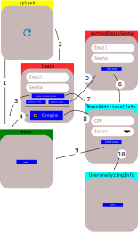

# ChangeLog
## [1.0.0]


# Estrutura
Leituras para analise e adaptação deste projeto a, View - ViewModel - Model e CleanCode:
* http://kyubid.com/blog/mvvm-android-tutorial-01-mvc-vs-mvp-vs-mvvm/
* https://pub.dev/packages/flutter_clean_architecture
* https://medium.com/@ajliberatore/android-clean-architecture-mvvm-4df18933fa9
* https://medium.com/@fahrizalfms/sample-android-project-mvvm-clean-architecture-with-coroutines-tips-a4d1b43b3583


Leituras:
* https://medium.com/@mashoodsidd97/understanding-of-clean-architecture-in-your-flutter-apps-with-tdd-test-driven-development-e674429fa0d
* https://medium.com/@mashoodsidd97/clean-architecture-tdd-with-flutter-part-2-968c7fc52c5b
* 

# Authentication
O Fluxo de autenticação segue esta abordagem:
1. Usuário acessa ao aplicativo e **splash.page** analisa sua situação. Se estiver logado vai para **home.page**.
2. Usuário acessa ao aplicativo e **splash.page** analisa sua situação. Se não estiver logado vai para **login.page**.
3. Usuário informa email/senha e se cadastrado e informações adicionais regularizadas e vai para **home.page**.
4. Usuário informa provedor de acesso e se cadastrado e informações adicionais regularizadas vai para **home.page**.
5. Se solicitar cadastrar email/senha para acesso vai para **methodEmailSenha.page**.
6. Após informar email/senha para cadastro se existir informações adicionais segue para **UserAdditionalInfo.page**.
7. Usuário informa email/senha e se cadastrado e informações adicionais irregulares vai para **UserAdditionalInfo.page**.
8. Usuário informa provedor de acesso e se cadastrado e informações adicionais irregulares vai para **UserAdditionalInfo.page**.
9. Registrada as informações adicionais se não houver analise vai para **home.page**.
10. Registrada as informações adicionais se houver analise vai para **UserAnalyzingInfo.page**. E espera-se liberação dos administradores do app. 



## MVVM/CleanCode
Se o objetivo de uma abstração/interface é guiar as implementações ?
Esta abordagem a seguir esta correta ?
* view
* view-model
* model
  * models
    * taskModel.dart
  * repositories
    * task_repository_abstract.dart
    * firebase
      * task
        * task_repository_impl.dart
    * hive
      * task
        * task_repository_impl.dart

model/repositories/task_repository_abstract.dart
```Dart
abstract class TaskRepositoryAbstract {
  Future<void> create(TaskModel taskModel);
}
```
## Firebase
model/repositories/firebase/task_repository_impl.dart
```Dart
class TaskRepositoryImpl implements TaskRepositoryAbstract {
  @override
  Future<void> create(TaskModel taskModel){
    // create modo Firebase
  }
}
```
## Hive
model/repositories/hive/task_repository_impl.dart
```Dart
class TaskRepositoryImpl implements TaskRepositoryAbstract {
  @override
  Future<void> create(TaskModel taskModel){
    // create modo Hive
  }
}
```


# Databases

## Isar
Encontrei problemas no Isar e abortei a inclusão esta versão
1. https://tomicriedel.medium.com/flutter-isar-database-the-complete-crash-course-part-1-bbd08aa7cc4e
2. https://isar.dev/tutorials/quickstart.html
3. https://pub.dev/packages/isar
4. 
